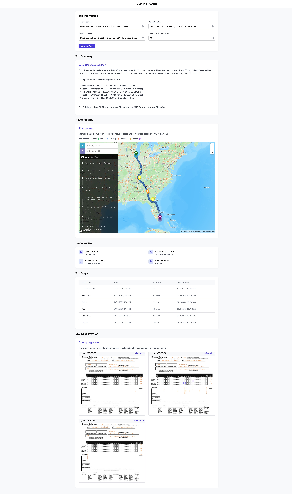

# Trip Planning and ELD Log Application

## Overview

This application is built with Django and React (Nextjs) that takes trip details as input and outputs route instructions and ELD (Electronic Logging Device) logs. It helps property-carrying drivers plan their trips while adhering to Hours of Service (HOS) regulations. The frontend provides a user interface for inputting trip details, visualizing the route on a map, and viewing the generated ELD logs and a summary of the trip.

## Live Demo

[https://eld-trip-tracker.vercel.app/](https://eld-trip-tracker.vercel.app/)
[Demo video](https://www.loom.com/share/0cc16520bd74478d89eb19a46bfc6aed?sid=f3cb3df4-53a7-4b56-bc4a-1bd5b357fc0b)

## Preview


<details>
    <summary>Click to Enlarge Image</summary>
    
</details>

## Features

* **Trip Creation and Retrieval:** Allows users to save new trip details and retrieve a plan for the trip. The frontend provides a form for inputting trip details.
* **Route Calculation:** Calculates the optimal route between the pickup and dropoff locations, considering the current location. The route is visualized on a map in the frontend.
* **Fuel Stop Optimization:** Automatically identifies and includes optimal fuel stops (real gas stations) along the route, assuming fueling at least once every 1,000 miles. These stops are displayed on the map.
* **Pickup and Dropoff Handling:** Includes pickup and dropoff locations as part of the route planning and displays them on the map.
* **Rest Stop Calculation:** Calculates mandatory rest stops (70-hour rest) and rest breaks (30-minute breaks) based on the  HOS rule. Rest stops are visualized on the map.
* **ELD Daily Log Sheet Generation:** Generates daily log sheets in PDF format, filling them out with relevant trip and duty status information. These logs are displayed in the frontend.
* **Duty Status Tracking:** Automatically tracks and records duty status changes (off-duty, sleeper, driving, on-duty) throughout the trip, reflected in the ELD logs.
* **Map Integration:** The frontend uses the Mapbox GL JS library to display the route on a map, showing the current location, pickup location, dropoff location, fuel stops, and rest stops.
* **Considers Current Cycle:** Takes into account the driver's current cycle hours when planning the trip and rest stops.
* **LLM Trip Summary:** The frontend includes a feature to generate a summary of the trip using a Large Language Model (LLM).

## Technologies Used

**Backend (Django):**

* Python 3.12
* Django REST Framework
* Django GIS
* PostgreSQL
* MapBox API (for route calculation, finding points of interest, and geocoding)
* reportlab (for PDF generation)
* pdf2image (for converting PDF to image)
* polyline (for encoding/decoding route geometries)

**Frontend (React/Next.js):**

* React
* Next.js
* Tailwind CSS
* Mapbox GL JS
* Mapbox Geocoding API
* TypeScript

## Installation (Backend)

1.  **Clone the repository:**
    ```bash
    git clone https://github.com/kampkelly/ELDTripTracker.git
    cd server
    ```

2.  **Set up a virtual environment:**
    ```bash
    python -m venv venv
    source venv/bin/activate
    ```

3.  **Install dependencies:**
    ```bash
    pip install -r requirements.txt
    ```
    Alternatively, if you have `pip-tools` installed:
    ```bash
    pip install pip-tools
    make install
    ```

4.  **Create a `.env` file:**
    Create a `.env` file in the `server` directory based on the `.env.example` file and set the appropriate values for your database, Mapbox access token, and GDAL/GEOS library paths.

    ```
    DATABASE_NAME=eld_trip_tracker
    DATABASE_USERNAME=postgres
    DATABASE_PASSWORD=postgres
    DATABASE_HOST=localhost
    DATABASE_PORT=5432
    FRONTEND_URL=http://localhost:3000
    MAPBOX_ACCESS_TOKEN=YOUR_MAPBOX_ACCESS_TOKEN
    GEMINI_API_KEY=
    GDAL_LIBRARY_PATH=/path/to/gdal
    GEOS_LIBRARY_PATH=/path/to/geos
    ```

5.  **Apply database migrations:**
    ```bash
    python eld_trip_tracker/manage.py migrate
    ```
    or
    ```bash
    make run-migration
    ```

6.  **Run the development server:**
    ```bash
    python eld_trip_tracker/manage.py runserver
    ```
    or
     ```bash
    make start-app
    ```
    The backend will be accessible at `http://localhost:8000/api/v1/`.

## Installation (Frontend)

1.  **Navigate to the frontend directory:**
    ```bash
    cd client
    ```

2.  **Install dependencies:**
    ```bash
    yarn install
    ```

3.  **Create a `.env` file:**
    Create a `.env` file in the `client` directory and add your Mapbox public token and the backend API endpoint.

    ```
    NEXT_PUBLIC_MAPBOX_TOKEN=YOUR_MAPBOX_PUBLIC_TOKEN
    NEXT_PUBLIC_TRIP_API_ENDPOINT=http://localhost:8000/api/v1
    ```

4.  **Run the frontend development server:**
    ```bash
    yarn dev
    ```
    The frontend will be accessible at `http://localhost:3000/`.

## Usage

1.  **Start both the backend and frontend development servers.**
2.  **Open your browser and navigate to the frontend URL (usually `http://localhost:3000/`).**
3.  **Enter the trip details in the form:** Current location, pickup location, dropoff location, and current cycle hours. Location inputs provide autocompletion using the Mapbox Geocoding API.
4.  **Submit the form.** The application will send the trip details to the backend.
5.  **View the route on the map:** The map will display the calculated route, including all stops (pickup, dropoff, fuel, and rest).
6.  **View the ELD log sheets:** The generated daily log sheets will be displayed.
7.  **Generate Trip Summary:** Click the "Generate Trip Summary" button to get an LLM-generated summary of your trip.

## Assumptions

The application makes the following assumptions based on the assessment instructions:

* **Driver Type:** Property-carrying driver.
* **HOS Regulations:** 70 hours/8 days cycle, no adverse driving conditions.
* **Rest Stos:** 30 minutes rest for every 8 hours driving.
* **Fueling:** Fueling occurs at least once every 1,000 miles.
* **Pickup and Drop-off Time:** 1 hour is allocated for both pickup and drop-off.

## Environment Variables

**Backend:**

* `DATABASE_NAME`: Name of the PostgreSQL database.
* `DATABASE_USERNAME`: Username for the PostgreSQL database.
* `DATABASE_PASSWORD`: Password for the PostgreSQL database.
* `DATABASE_HOST`: Hostname or IP address of the PostgreSQL server.
* `DATABASE_PORT`: Port number of the PostgreSQL server (default is 5432).
* `MAPBOX_ACCESS_TOKEN`: Your access token for the Mapbox API (used for backend calculations).
* `GDAL_LIBRARY_PATH`: Path to the GDAL library on your system.
* `GEOS_LIBRARY_PATH`: Path to the GEOS library on your system.

**Frontend:**

* `NEXT_PUBLIC_MAPBOX_TOKEN`: Your public access token for the Mapbox API (used for displaying the map and geocoding).
* `NEXT_PUBLIC_TRIP_API_ENDPOINT`: The URL of your backend API (e.g., `http://localhost:8000/api/v1`).

## Frontend Structure

The frontend codebase is structured as follows:

* `app/`: Contains the main application routes and the main page (`page.tsx`).
* `app/api/proxy/route.ts`: Defines the API proxy route for the backend.
* `components/`: Contains reusable UI components such as the map, log sheet viewer, and location input.
* `styles/`: Contains global CSS styles.

## Code Style and Quality

**Backend:**

The backend codebase follows the PEP 8 style guide and uses `flake8`, `black`, `isort`, and `mypy`.
